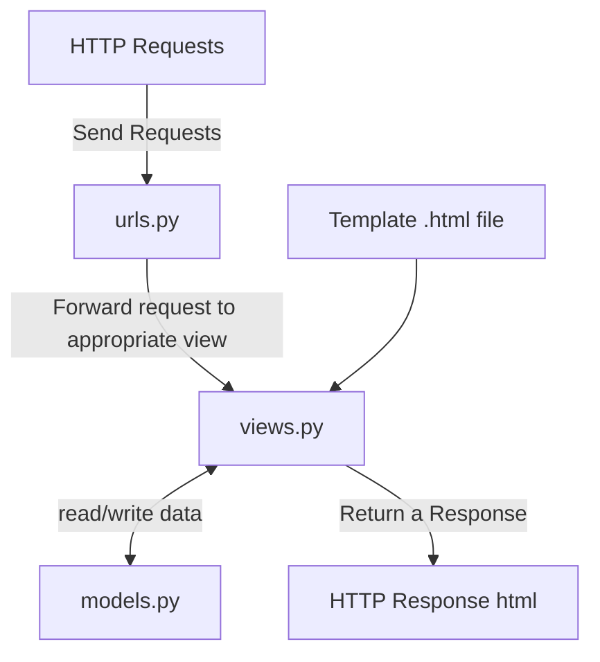

# FORMERCE

------ 

[Visit Website](https://muhammad-wendy-formerce.pbp.cs.ui.ac.id/)

## Pertanyaan dan Jawaban

A. Jelaskan bagaimana cara kamu mengimplementasikan checklist di atas secara step-by-step (bukan hanya sekadar mengikuti tutorial)

1. menjalankan program `django-admin startproject formerce .\` untuk membuat project django baru

2. menjalankan program `python manage.py startapp main` untuk membuat aplikasi baru bernama main pada proyek.

3. Menambahkan `path('', include('main.urls')),` pada formerce/urls/py untuk me-route proyek sehingga dapat menjalankan aplikasi main

```
from django.contrib import admin
from django.urls import path, include

urlpatterns = [
    path('admin/', admin.site.urls),
    path('', include('main.urls')),
]
```

4. Pada models.py, membuat class Product dengan atribut name, price, dan description yang masing-masing bertipe model.charField, models.IntegerField, models.TextField.

```
from django.db import models

class Product(models.Model):
    name = models.CharField(max_length=255)
    price = models.IntegerField()
    description = models.TextField()
``` 

5. Membuat sebuah fungsi pada views.py yang mengembalikan sebuah template HTML untuk menampilkan nama aplikasi serta nama dan kelas saya.

***views.py***

```
from django.shortcuts import render

def show_main(request):
    context = {
        'project_name': 'Formerce',
        'name' : 'Muhammad Wendy Fyfo Anggara',
        'kelas': 'PBP E',
    }

    return render(request, "main.html", context)
```

***main.html***

```
<!DOCTYPE html>

<h1>{{ project_name }}</h1>
<p>{{ name }} ------- {{ kelas }}</p>
```

6. Membuat routing pada urls.py pada aplikasi main untuk memetakan fungsi yang telah dibuat pada views.py

```
from django.urls import path
from main.views import show_main

urlpatterns = [
path('', show_main, name='show_main'),
]
```

7.melakukakan *deployment* ke PWS dengan membuat project baru pada website PWS dan push project ke PWS.
 
B. Buatlah bagan yang berisi request client ke web aplikasi berbasis Django beserta responnya dan jelaskan pada bagan tersebut kaitan antara urls.py, views.py, models.py, dan berkas html.


1. urls.py menerima HTTP request
2. urls.py parse request dan meneruskannya ke views.py yang sesuai
3. views.py membaca/memperbarui models.py sesuai request
4. views.py mengembalikan respon dengan file html yang sesuai dengan request dan hasil  *read/write* models.py ke user

C. Jelaskan fungsi git dalam pengembangan perangkat lunak!

> Fungsi git dalam pengembangan perangkat lunak adalah menjadi **sistem kontrol versi** yang membantu melacak perubahan pada kode sumber proyek. Git memberikan kemampuan untuk memantau semua revisi yang pernah dilakukan selama proses pengembangan perangkat lunak.

D. Menurut Anda, dari semua framework yang ada, mengapa framework Django dijadikan permulaan pembelajaran pengembangan perangkat lunak?

>Django adalah framework yang dibuat di atas bahasa pemrograman python, sehingga penggunaan bahasa pemrograman yang mudah menjadi salah satu alasannya. Selain itu, Django hadir dengan banyak fitur siap pakai yang memudahkan pemula untuk membangun perangkat lunak dengan mudah dan cepat.

E. Mengapa model pada Django disebut sebagai ORM?

>Kepanjangan dari ORM adalah **Object-Relational Mapper**. ORM adalah fitur/teknik yang memungkinkan kita untuk berinteraksi langsung dengan database menggunakan class python tanpa perlu menuliskan SQL queries. Model pada Django disebut sebagai ORM karena model adalah object python karena teknik ORM memetakan relasi antara **database** dengan sebuah model, sehingga setiap class model merepresentasikan sebuah tabel database yang memiliki atribut yang berhubungan dengan sebuah kollom pada tabel tersebut.