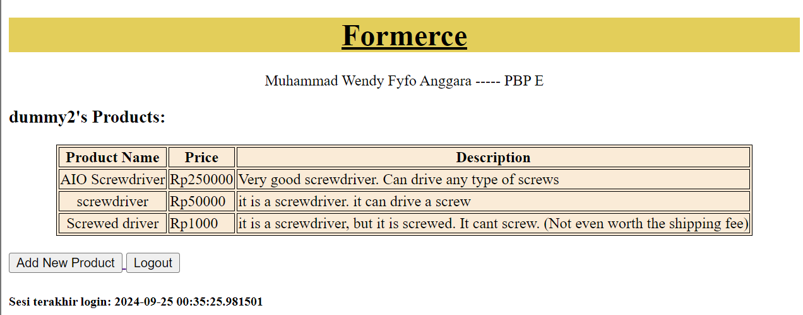

# FORMERCE

## URLs 
- Visit [Formerce](http://muhammad-wendy-formerce.pbp.cs.ui.ac.id/)
- Tugas
    - [Tugas 4](#pertanyaan-dan-jawaban-tugas-4)
    - [Tugas 3](#pertanyaan-dan-jawaban-tugas-3)
    - [Tugas 2](#pertanyaan-dan-jawaban-tugas-2)

## Pertanyaan dan Jawaban Tugas 4
A. Apa perbedaan antara `HttpResponseRedirect() dan `redirect()` ?
> HttpResponseRedirect() merupakan class yang memiliki parameter berupa URL path (bisa absolute maupun relative path) sebagai destinasi pengalihan halaman user. redirect adalah fungsi yang menerima parameter lebih abstrak. Fungsi ini dapat menerima argumen berupa URL, pola URL, atau objek model dan akan mendapatkan path URL berdasarkan parameter dengan menggunakan fungsi get_absolute_url().

B. Jelaskan cara kerja penghubungan model `Product` dengan `User` !
> Cara kerja penghubungan model `Product` dengan `User` adalah dengan menggunakan field `ForeignKey` untuk sebuah entri yang merujuk ke model `User`. penghubungan ini akan membentuk relasi "many-to-one", dimana banyak objek dapat merujuk ke satu objek `User`. Dengan `ForeignKey`. Django akan secara otomatis menghubungkan objek `ProductEntry` ke suatu `User` berdasarkan id dari model `User`.

C. Apa perbedaan antara authentication dan authorization, apakah yang dilakukan saat pengguna login? Jelaskan bagaimana Django mengimplementasikan kedua konsep tersebut!
> *Authentication* adalah proses memverifikasi identitas user. Artinya,  sistem mengecek apakah pengguna adalah siapa yang mereka klaim, biasanya melalui kredensial seperti username dan password.

> *Authorization* adalah proses menentukan apakah user memiliki izin untuk mengakses suatu data atau proses dalam sistem. 

> Yang user lakukan saat login adalah *authentication* 

> *Authentication* diimplementasikan dengan memvalidasi data yang diberikan user dengan data yang ada di dalam model `User`. *Authorization* diimplementasikan  dengan menggunakan user permission, group, dan decorator untuk membatasi akses sebuah fungsi atau data seperti `@login_required`.

D. Bagaimana Django mengingat pengguna yang telah login? Jelaskan kegunaan lain dari cookies dan apakah semua cookies aman digunakan?
> Cara Django mengingat pengguna yang telah login adalah membuat sebuah *session* dengan ID unik yang terhubung dengan user tersebut. ID tadi disimpan di dalam cookie pada browser user, lalu cookie tersebut digunakan dengan cara dikirim bersamaan dengan setiap request HTTP ke server. Ketika pengguna mengunjungi halaman lain setelah login, Django memeriksa cookie yang dikirim oleh browser untuk mendapatkan session ID. Dengan session ID ini, Django bisa memuat data sesi dari server dan mengidentifikasi pengguna yang sedang terautentikasi.

> Keggunaan lain dari cookies adalah untuk menyimpan preferensi pengguna (seperti bahasa dan tema), melacak aktivitas pengguna, dan melakukan login otomatis. Tidak semua cookies aman digunakan. Beberapa contoh dari cookies yang tidak aman adalah cookies yang tidak dienkripsi dan cookies yang disimpan dalam jangka waktu yang lama. Kedua contoh tadi menjadikan cookies sebagai sasaran untuk mendapatkan informasi sensitif dari user.

E. Jelaskan bagaimana cara kamu mengimplementasikan checklist di atas secara step-by-step (bukan hanya sekadar mengikuti tutorial).
1. Menambahkan import `UserCreationForm` dan `messages` dan fungsi register pada `views.py`.
```python
from django.contrib.auth.forms import UserCreationForm
from django.contrib import messages

...

def register(request):
    form = UserCreationForm()

    if request.method == "POST":
        form = UserCreationForm(request.POST)
        if form.is_valid():
            form.save()
            messages.success(request, 'Your account has been successfully created!')
            return redirect('main:login')
    context = {'form':form}
    return render(request, 'register.html', context)
```
2. Mermbuat berkas `register.html` pada direktori `main/templates`.
```html



<title>Register</title>




<div class="login">
  <h1>Register</h1>

  <form method="POST">
    
    <table>
      {{ form.as_table }}
      <tr>
        <td></td>
        <td><input type="submit" name="submit" value="Daftar" /></td>
      </tr>
    </table>
  </form>

  
  <ul>
    
    <li>{{ message }}</li>
    
  </ul>
  
</div>


```

3. Menambahkan fungsi views baru dan path url-nya ke `urls.py` pada `main`.
```python
from main.views import register

...

urlpatterns = [
    ...
    path('register/', register, name='register'),
]
```
4. Membuat fungsi login pada `views.py` pada `main`.
```python
from django.contrib.auth.forms import UserCreationForm, AuthenticationForm
from django.contrib.auth import authenticate, login
...
def login_user(request):
   if request.method == 'POST':
      form = AuthenticationForm(data=request.POST)

      if form.is_valid():
            user = form.get_user()
            login(request, user)
            return redirect('main:show_main')

   else:
      form = AuthenticationForm(request)
   context = {'form': form}
   return render(request, 'login.html', context)
```

5. Membuat berkas baru `login.html` pada `main/templates` dan menambahkan path urlnya ke dalam `urls.py`
```html



<title>Login</title>



<div class="login">
  <h1>Login</h1>

  <form method="POST" action="">
    
    <table>
      {{ form.as_table }}
      <tr>
        <td></td>
        <td><input class="btn login_btn" type="submit" value="Login" /></td>
      </tr>
    </table>
  </form>

  
  <ul>
    
    <li>{{ message }}</li>
    
  </ul>
   Don't have an account yet?
  <a href="">Register Now</a>
</div>


```

```python
from main.views import login_user
urlpatterns = [
   ...
   path('login/', login_user, name='login'),
]
```

6. Membuat fungsi logout pada `views.py`, menambahkan path url-nya ke `main/urls.py`, dan membuat tombol logout pada `main/templates/main.html`

`views.py`
```python
from django.contrib.auth import logout
...
def logout_user(request):
    logout(request)
    return redirect('main:login')
```
`urls.py`
```python
from main.views import logout_user
urlpatterns = [
   ...
   path('logout/', logout_user, name='logout'),
]
```
`main.html`
```html
...
<a href="">
  <button>Logout</button>
</a>
...
```

7. Merekstriksi akses halaman main sehingga memerlukan login dengan menambahkan decorator pada fungsi `show_main` dalam `views.py`.
```python
from django.contrib.auth.decorators import login_required
...
@login_required(login_url='/login')
def show_main(request):
...
```

8. Menggunakan cookies untuk menunjukan login terakhir dengan menambahkan beberapa baris kode `views.py`
```python
import datetime
from django.http import HttpResponseRedirect
from django.urls import reverse
...
def show_main(request):
  ...
  context = {
    'name': 'Pak Bepe',
    'class': 'PBP D',
    'npm': '2306123456',
    'mood_entries': mood_entries,
    'last_login': request.COOKIES['last_login'],
  ...
}
...
def login_user(request):
  ...
  if form.is_valid():
      user = form.get_user()
      login(request, user)
      response = HttpResponseRedirect(reverse("main:show_main"))
      response.set_cookie('last_login', str(datetime.datetime.now()))
      return response
...
def logout_user(request):
    logout(request)
    response = HttpResponseRedirect(reverse('main:login'))
    response.delete_cookie('last_login')
    return response
...
```
8. menambahkan baris kode untuk menampilkan data *last login* pada `main.html`
```html
...
<h5>Sesi terakhir login: {{ last_login }}</h5>
...
```

9. Meenghubungkan Model `ProductEntry` dengan `User` dengan menambahkan beberapa potongan kode pada `models.py` dan `views.py`

`models.py`
```python
...
from django.contrib.auth.models import User
...
class ProductEntry(models.Model):
    user = models.ForeignKey(User, on_delete=models.CASCADE)
    ...
```
`views.py`
```python
...
def show_main(request):
    product_entries = ProductEntry.objects.filter(user=request.user)

    context = {
         'name': request.user.username,
         ...
    }
...
def create_product_entry(request):
    form = ProductEntryForm(request.POST or None)

    if form.is_valid() and request.method == "POST":
        product_entry = form.save(commit=False)
        product_entry.user = request.user
        product_entry.save()
        return redirect('main:show_main')

    context = {'form': form}
    return render(request, "create_product_entry.html", context)
 ...
...
```

10. Membutkan 2 akun dummy dengan masing-masing 3 product di lokal
- 'dummy1'


- 'dummy2'
 

## Pertanyaan dan Jawaban Tugas 3
A. Jelaskan mengapa kita memerlukan data delivery dalam pengimplementasian sebuah platform?
> Data delivery butuh diimplementasikan karena kita perlu mengirimkan data dari satu stack ke stack lainnya.

B. Menurutmu, mana yang lebih baik antara XML dan JSON? Mengapa JSON lebih populer dibandingkan XML?
> Menurut saya JSON lebih baik dibandingkan dengan XML. JSON lebih populer dibandingkan XML karena *syntax* nya yang lebih mudah dibaca, skema dokumentasi yang lebih simpel dan fleksibel, ukuran berkas yang lebih kecil, dan lebih aman.

C.  Jelaskan fungsi dari method is_valid() pada form Django dan mengapa kita membutuhkan method tersebut?
> Fungsi dari Method is_valid() adalah untuk mengecek apakah data yang diinput valid dengan *data field* yang ada dan mengembalikan boolean berdasarkan hasil validasi. *Method* ini dibutuhkan untuk memastikan bahwa data yang diinput sesuai dengan yang diminta dan aman sebelum diproses lebih lanjut.

D.  Mengapa kita membutuhkan csrf_token saat membuat form di Django? Apa yang dapat terjadi jika kita tidak menambahkan csrf_token pada form Django? Bagaimana hal tersebut dapat dimanfaatkan oleh penyerang?
> csrf_token dibutuhkan untuk menlindungi serangan *Cross-Site Request Forgery*, yaitu serangan yang membuat browser pengguna melakukan aksi-aksi yang tidak diinginkan seperti mentransfer uang atau mengubah email yang terdaftar. csrf_token melindungi dari serangan ini dengan cara membuat sebuah token secara acak dan unik setiap pengguna memulai sesi di suatu website, lalu menggunakan token tersebut untuk memverifikasi setiap request yang diproses.

E. Jelaskan bagaimana cara kamu mengimplementasikan checklist di atas secara step-by-step (bukan hanya sekadar mengikuti tutorial).

1. Membuat berkas baru bernama `base.html` pada direktori `templates` yang digunakan sebagai template dasar dan kerangka umum halaman web lainnya pada proyek dengan konten seperti berikut:
```html

<!DOCTYPE html>
<html lang="en">
  <head>
    <meta charset="UTF-8" />
    <meta name="viewport" content="width=device-width, initial-scale=1.0" />
     
  </head>

  <body>
     
  </body>
</html>
```
Lalu saya menambahkan `'templates'` pada variabel TEMPLATES dalam berkas `settings.py`

2. Mengubah kode pada berkas `main.html` untuk menggunakan `base.html sebagai *template* utama.

3. Membuat berkas baru `forms.py` pada direktori main untuk membuat struktur form yang dapat menerima data *Product Entry* baru. 
```python
from django.forms import ModelForm
from main.models import ProductEntry

class ProductEntryForm(ModelForm):
    class Meta:
        model = ProductEntry
        fields = ["name", "price", "description"]
```
4. Membuat fungsi baru pada `views.py` yang menerima parameter `request` untuk menghasilkan form yang dapat menambahkan data Product Entry secara otomatis ketika data di-submit dari form.
```python
def create_product_entry(request):
    form = ProductEntryForm(request.POST or None)

    if form.is_valid() and request.method == "POST":
        form.save()
        return redirect('main:show_main')

    context = {'form': form}
    return render(request, "create_product_entry.html", context)
```

5.Mengubah fungsi show_main pada berkas yang sama untuk dapat mengambil seluruh objek `ProductEntry` pada database.
```python
def show_main(request):
    product_entries = ProductEntry.objects.all()

    context = {
        'project_name': 'Formerce',
        'name' : 'Muhammad Wendy Fyfo Anggara',
        'class': 'PBP E', 
        'product_entries': product_entries,
    }

    return render(request, "main.html", context)
```

6. Menambahkan path URL untuk membuat ProductEntry ke dalam variabel urlpatterns pada urls.py di main untuk mengakses fungsi pada `views.py`
```python
urlpatterns = [
   ...
   path('create-product-entry', create_product_entry,name='create_product_entry')
]
```

7. Membuat berkas HTML baru dengan nama create_product_entry.html pada direktori `main/templates`
```html
 

<h1>Add New Product Entry</h1>

<form method="POST">
  
  <table>
    {{ form.as_table }}
    <tr>
      <td></td>
      <td>
        <input type="submit" value="Add Product Entry" />
      </td>
    </tr>
  </table>
</form>


```

8. Menambahkan kode pada `main.html` untuk menampilkan product serta tombol yang me-*redirect* ke halaman form. 
```html
<!DOCTYPE html>



<h1>{{ project_name }}</h1>
<p>{{ name }} ----- {{ class }}</p>

<h3>Products:</h3>


<p>Belum ada product yang terdaftar.</p>

<table>
  <tr>
    <th>Product Name</th>
    <th>Price</th>
    <th>Description</th>
  </tr>

  
  <tr>
    <td>{{product_entry.name}}</td>
    <td>{{product_entry.price}}</td>
    <td>{{product_entry.description}}</td>
  </tr>
  
</table>


<br />

<a href="">
  <button>Add New Product</button>
</a>

```

9. Menambahkan empat fungsi baru pada `views.py` untuk mengembalikan data dalam bentuk XML atau JSON, serta menampilkan semua atau berdasarkan id
```python
def show_xml(request):
    data = ProductEntry.objects.all()
    return HttpResponse(serializers.serialize("xml", data), content_type="application/xml")


def show_json(request):
    data = ProductEntry.objects.all()
    return HttpResponse(serializers.serialize("json", data), content_type="application/json")

def show_xml_by_id(request,id):
    data = ProductEntry.objects.filter(pk=id)
    return HttpResponse(serializers.serialize("xml", data), content_type="application/xml")


def show_json_by_id(request,id):
    data = ProductEntry.objects.filter(pk=id)
    return HttpResponse(serializers.serialize("json", data), content_type="application/json")

```

10. Menambahkan path url ke dalam urlpatterns pada `main/urls.py` untuk mengakses fungsi-fungsi di atas.
```python
urlpatterns = [
    ...
    path('xml/', show_xml, name='show_xml'),
    path('json/', show_json, name='show_json'),
    path('xml/<str:id>/', show_xml_by_id, name='show_xml_by_id'),
    path('json/<str:id>', show_json_by_id, name='show_json_by_id'),
]
```

### Lampiran --- Hasil akses keempat URL pada Postman 
- '/xml'


- '/xml/[id]'
 

- '/json'
 

- '/json/[id]'
 

## Pertanyaan dan Jawaban Tugas 2

A. Jelaskan bagaimana cara kamu mengimplementasikan checklist di atas secara step-by-step (bukan hanya sekadar mengikuti tutorial)

1. menjalankan program `django-admin startproject formerce .\` untuk membuat project django baru

2. menjalankan program `python manage.py startapp main` untuk membuat aplikasi baru bernama main pada proyek.

3. Menambahkan `path('', include('main.urls')),` pada formerce/urls/py untuk me-route proyek sehingga dapat menjalankan aplikasi main

```python
from django.contrib import admin
from django.urls import path, include

urlpatterns = [
    path('admin/', admin.site.urls),
    path('', include('main.urls')),
]
```

4. Pada models.py, membuat class Product dengan atribut name, price, dan description yang masing-masing bertipe model.charField, models.IntegerField, models.TextField.

```python
from django.db import models

class Product(models.Model):
    name = models.CharField(max_length=255)
    price = models.IntegerField()
    description = models.TextField()
``` 

5. Membuat sebuah fungsi pada views.py yang mengembalikan sebuah template HTML untuk menampilkan nama aplikasi serta nama dan kelas saya.

***views.py***

```python
from django.shortcuts import render

def show_main(request):
    context = {
        'project_name': 'Formerce',
        'name' : 'Muhammad Wendy Fyfo Anggara',
        'kelas': 'PBP E',
    }

    return render(request, "main.html", context)
```

***main.html***

```html
<!DOCTYPE html>

<h1>{{ project_name }}</h1>
<p>{{ name }} ------- {{ kelas }}</p>
```

6. Membuat routing pada urls.py pada aplikasi main untuk memetakan fungsi yang telah dibuat pada views.py

```python
from django.urls import path
from main.views import show_main

urlpatterns = [
path('', show_main, name='show_main'),
]
```

7.melakukakan *deployment* ke PWS dengan membuat project baru pada website PWS dan push project ke PWS.
 
B. Buatlah bagan yang berisi request client ke web aplikasi berbasis Django beserta responnya dan jelaskan pada bagan tersebut kaitan antara urls.py, views.py, models.py, dan berkas html.


1. urls.py menerima HTTP request
2. urls.py parse request dan meneruskannya ke views.py yang sesuai
3. views.py membaca/memperbarui models.py sesuai request
4. views.py mengembalikan respon dengan file html yang sesuai dengan request dan hasil  *read/write* models.py ke user

C. Jelaskan fungsi git dalam pengembangan perangkat lunak!

> Fungsi git dalam pengembangan perangkat lunak adalah menjadi **sistem kontrol versi** yang membantu melacak perubahan pada kode sumber proyek. Git memberikan kemampuan untuk memantau semua revisi yang pernah dilakukan selama proses pengembangan perangkat lunak.

D. Menurut Anda, dari semua framework yang ada, mengapa framework Django dijadikan permulaan pembelajaran pengembangan perangkat lunak?

>Django adalah framework yang dibuat di atas bahasa pemrograman python, sehingga penggunaan bahasa pemrograman yang mudah menjadi salah satu alasannya. Selain itu, Django hadir dengan banyak fitur siap pakai yang memudahkan pemula untuk membangun perangkat lunak dengan mudah dan cepat.

E. Mengapa model pada Django disebut sebagai ORM?

>Kepanjangan dari ORM adalah **Object-Relational Mapper**. ORM adalah fitur/teknik yang memungkinkan kita untuk berinteraksi langsung dengan database menggunakan class python tanpa perlu menuliskan SQL queries. Model pada Django disebut sebagai ORM karena model adalah object python karena teknik ORM memetakan relasi antara **database** dengan sebuah model, sehingga setiap class model merepresentasikan sebuah tabel database yang memiliki atribut yang berhubungan dengan sebuah kollom pada tabel tersebut.