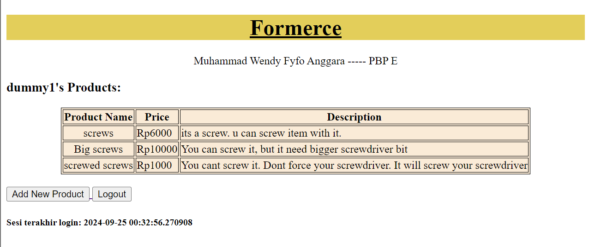

# FORMERCE

## URLs 
- Visit [Formerce](http://muhammad-wendy-formerce.pbp.cs.ui.ac.id/)
- Tugas
    - [Tugas 6](#pertanyaan-dan-jawaban-tugas-6)
    - [Tugas 5](#pertanyaan-dan-jawaban-tugas-5)
    - [Tugas 4](#pertanyaan-dan-jawaban-tugas-4)
    - [Tugas 3](#pertanyaan-dan-jawaban-tugas-3)
    - [Tugas 2](#pertanyaan-dan-jawaban-tugas-2)

## Pertanyaan dan Jawaban Tugas 6
A. Jelaskan manfaat dari penggunaan JavaScript dalam pengembangan aplikasi web!
>  Manfaat dari penggunaan JavaScript dalam pengembangan aplikasi web adalah memberikan kemampuan untuk memanipulasi halaman web secara dinamis, sehingga interaksi antara halaman web dapat meningkat.

B. Jelaskan fungsi dari penggunaan await ketika kita menggunakan fetch()! Apa yang akan terjadi jika kita tidak menggunakan await?
> fungsi `fetch()` diimplementasikan secara asinkronus, sehingga `await` digunakan agar eksekusi kode yang menggunakan keyword `await` menunggu fungsi async `fetch()` selesai. Jika `await` tidak digunakan, maka error akan terjadi akibat kode yang bergantung dengan hasil `fetch()` dieksekusi sebelum `fetch()` selesai.

C. Mengapa kita perlu menggunakan decorator csrf_exempt pada view yang akan digunakan untuk AJAX POST?
>  fungsi dari decorator `csrf_exempt` adalah untuk membuat Django tidak perlu mengecek keberadaan `csrf_token` pada `POST` request yang dikirimkan ke fungsi dibawah decorator tersebut. Decorator ini digunakan untuk fungsi dengan AJAX karena request AJAX POST tidak dikirim bersamaan dengan csrf_token. 

D.  Pada tutorial PBP minggu ini, pembersihan data input pengguna dilakukan di belakang (backend) juga. Mengapa hal tersebut tidak dilakukan di frontend saja?
> pembersihan data input pada frontend dan backend memiliki tujuan yang berbeda. Pembersihan pada frontend dilakukan untuk mengurangi request yang berlebihan pada server karena input pengguna divalidasi terlebih dahulu sebelum dikirimkan ke backend. Hal ini membantu penggguna untuk mengoreksi input yang dimasukkan. Pembersihan pada backend dilakukan juga karena validasi di frontend mudah untuk dimanipulasi atau dilewati, sehingga pembersihan di backend memberikan keamanan tambahan.

E.  Jelaskan bagaimana cara kamu mengimplementasikan checklist di atas secara step-by-step (bukan hanya sekadar mengikuti tutorial)!
  1. Mengubah fungsi `show_main()`, `show_xml()`, dan `show_json()` pada `main/views.py`
```python
@login_required(login_url='/login')
def show_main(request):

    context = {
        'project_name': 'Formerce',
        'name' : 'Muhammad Wendy Fyfo Anggara',
        'class': 'PBP E', 
        'loggedInUser': request.user.username,
        'last_login': request.COOKIES['last_login']
    }

    return render(request, "main.html", context)

def show_xml(request):
    data = ProductEntry.objects.filter(user=request.user)
    return HttpResponse(serializers.serialize("xml", data), content_type="application/xml")


def show_json(request):
    data = ProductEntry.objects.filter(user=request.user)
    return HttpResponse(serializers.serialize("json", data), content_type="application/json")
``` 
  2. Menghapus block conditional pada  `main/main.html`
```html
...
    
    <div class="flex flex-col items-center justify-center min-h-[24rem] p-6">
        
        <p class="text-center text-gray-600 mt-4">Belum ada data product pada Formerce.</p>
    </div>
    
    <div class="columns-1 sm:columns-2 lg:columns-3 gap-6 space-y-6 w-full">
        
            
        
    </div>
    
...
```

  3. Menambahkan block `<script>` pada bagian bawah `main.html` untuk mendapatkan data product_entries. dan refresh data product secara asinkronus
```html
<script>
    async function getProductEntries(){
      return fetch("").then((res) => res.json())
  }

  async function refreshProductEntries() {
    document.getElementById("product_entry_cards").innerHTML = "";
    document.getElementById("product_entry_cards").className = "";
    const productEntries = await getProductEntries();
    let htmlString = "";
    let classNameString = "";

    if (productEntries.length === 0) {
        classNameString = "flex flex-col items-center justify-center min-h-[24rem] p-6";
        htmlString = `
            <div class="flex flex-col items-center justify-center min-h-[24rem] p-6">
                
                <p class="text-center text-gray-600 mt-4">Belum ada data product pada mental health tracker.</p>
            </div>
        `;
    }
    else {
        classNameString = "columns-1 sm:columns-2 lg:columns-3 gap-6 space-y-6 w-full"
        moodEntries.forEach((item) => {
            const mood = DOMPurify.sanitize(item.fields.mood);
            const feelings = DOMPurify.sanitize(item.fields.feelings);
            htmlString += `
            <div class="relative break-inside-avoid">
                <div class="absolute top-2 z-10 left-1/2 -translate-x-1/2 flex items-center -space-x-2">
                    <div class="w-[3rem] h-8 bg-gray-200 rounded-md opacity-80 -rotate-90"></div>
                    <div class="w-[3rem] h-8 bg-gray-200 rounded-md opacity-80 -rotate-90"></div>
                </div>
                <div class="relative top-5 bg-indigo-100 shadow-md rounded-lg mb-6 break-inside-avoid flex flex-col border-2 border-indigo-300 transform rotate-1 hover:rotate-0 transition-transform duration-300">
                    <div class="bg-indigo-200 text-gray-800 p-4 rounded-t-lg border-b-2 border-indigo-300">
                        <h3 class="font-bold text-xl mb-2">${item.fields.name}</h3>
                        <p class="text-gray-600">${item.fields.price}</p>
                    </div>
                    <div class="p-4">
                        <p class="font-semibold text-lg mb-2">Price</p>
                        <p class="text-gray-700 mb-2">
                            <span class="bg-[linear-gradient(to_bottom,transparent_0%,transparent_calc(100%_-_1px),#CDC1FF_calc(100%_-_1px))] bg-[length:100%_1.5rem] pb-1">${item.fields.description}</span>
                        </p>
                    </div>
                </div>
                <div class="absolute top-0 -right-4 flex space-x-1">
                    <a href="/edit-product/${item.pk}" class="bg-yellow-500 hover:bg-yellow-600 text-white rounded-full p-2 transition duration-300 shadow-md">
                        <svg xmlns="http://www.w3.org/2000/svg" class="h-9 w-9" viewBox="0 0 20 20" fill="currentColor">
                            <path d="M13.586 3.586a2 2 0 112.828 2.828l-.793.793-2.828-2.828.793-.793zM11.379 5.793L3 14.172V17h2.828l8.38-8.379-2.83-2.828z" />
                        </svg>
                    </a>
                    <a href="/delete/${item.pk}" class="bg-red-500 hover:bg-red-600 text-white rounded-full p-2 transition duration-300 shadow-md">
                        <svg xmlns="http://www.w3.org/2000/svg" class="h-9 w-9" viewBox="0 0 20 20" fill="currentColor">
                            <path fill-rule="evenodd" d="M9 2a1 1 0 00-.894.553L7.382 4H4a1 1 0 000 2v10a2 2 0 002 2h8a2 2 0 002-2V6a1 1 0 100-2h-3.382l-.724-1.447A1 1 0 0011 2H9zM7 8a1 1 0 012 0v6a1 1 0 11-2 0V8zm5-1a1 1 0 00-1 1v6a1 1 0 102 0V8a1 1 0 00-1-1z" clip-rule="evenodd" />
                        </svg>
                    </a>
                </div>
            </div>
            `;
        });
    }
    document.getElementById("product_entry_cards").className = classNameString;
    document.getElementById("product_entry_cards").innerHTML = htmlString;
  }

refreshProductEntries();
</script>

```

  4. Menambahkan dua impor baru dan membuat fungsi baru pada `main/views.py`
```python
from django.views.decorators.csrf import csrf_exempt
from django.views.decorators.http import require_POST
from django.utils.html import strip_tags
...
@csrf_exempt
@require_POST
def add_product_entry_ajax(request):
    product = strip_tags(request.POST.get("product"))
    price = strip_tags(request.POST.get("price"))
    description = request.POST.get("description")
    user = request.user

    new_product = ProductEntry(
        product=product, price=price,
        description=description,
        user=user
    )
    new_product.save()

    return HttpResponse(b"CREATED", status=201)
```

  5. Menambahkan path url dari fungsi yang baru dibuat
```python
...
  path('create-ajax', add_product_entry_ajax, name='add_product_entry_ajax'),
...
```

  6. Membuat modal pada `main.html`  untuk menambahkan product baru
```html
    <div id="product_entry_cards"></div>
    <div id="crudModal" tabindex="-1" aria-hidden="true" class="hidden fixed inset-0 z-50 w-full flex items-center justify-center bg-gray-800 bg-opacity-50 overflow-x-hidden overflow-y-auto transition-opacity duration-300 ease-out">
      <div id="crudModalContent" class="relative bg-white rounded-lg shadow-lg w-5/6 sm:w-3/4 md:w-1/2 lg:w-1/3 mx-4 sm:mx-0 transform scale-95 opacity-0 transition-transform transition-opacity duration-300 ease-out">
        <!-- Modal header -->
        <div class="flex items-center justify-between p-4 border-b rounded-t">
          <h3 class="text-xl font-semibold text-gray-900">
            Add New Product Entry
          </h3>
          <button type="button" class="text-gray-400 bg-transparent hover:bg-gray-200 hover:text-gray-900 rounded-lg text-sm p-1.5 ml-auto inline-flex items-center" id="closeModalBtn">
            <svg aria-hidden="true" class="w-5 h-5" fill="currentColor" viewBox="0 0 20 20" xmlns="http://www.w3.org/2000/svg">
              <path fill-rule="evenodd" d="M4.293 4.293a1 1 0 011.414 0L10 8.586l4.293-4.293a1 1 0 111.414 1.414L11.414 10l4.293 4.293a1 1 0 01-1.414 1.414L10 11.414l-4.293 4.293a1 1 0 01-1.414-1.414L8.586 10 4.293 5.707a1 1 0 010-1.414z" clip-rule="evenodd"></path>
            </svg>
            <span class="sr-only">Close modal</span>
          </button>
        </div>
        <!-- Modal body -->
        <div class="px-6 py-4 space-y-6 form-style">
          <form id="productEntryForm">
            <div class="mb-4">
              <label for="product" class="block text-sm font-medium text-gray-700">Product</label>
              <input type="text" id="product" name="product" class="mt-1 block w-full border border-gray-300 rounded-md p-2 hover:border-indigo-700" placeholder="Enter your product" required>
            </div>
            <div class="mb-4">
              <label for="price" class="block text-sm font-medium text-gray-700">Price</label>
              <textarea id="price" name="price" rows="3" class="mt-1 block w-full h-52 resize-none border border-gray-300 rounded-md p-2 hover:border-indigo-700" placeholder="Describe your price" required></textarea>
            </div>
            <div class="mb-4">
              <label for="productDescription" class="block text-sm font-medium text-gray-700">Description</label>
              <input type="number" id="productDescription" name="product_description" min="1" max="10" class="mt-1 block w-full border border-gray-300 rounded-md p-2 hover:border-indigo-700" required>
            </div>
          </form>
        </div>
        <!-- Modal footer -->
        <div class="flex flex-col space-y-2 md:flex-row md:space-y-0 md:space-x-2 p-6 border-t border-gray-200 rounded-b justify-center md:justify-end">
          <button type="button" class="bg-gray-500 hover:bg-gray-600 text-white font-bold py-2 px-4 rounded-lg" id="cancelButton">Cancel</button>
          <button type="submit" id="submitProductEntry" form="productEntryForm" class="bg-indigo-700 hover:bg-indigo-600 text-white font-bold py-2 px-4 rounded-lg">Save</button>
        </div>
      </div>
    </div>
```

  7. Menambahkan fungsi-fungsi JavaScript untuk modal yang baru dibuat pada `main.html`
```html
<script>
  ...
  const modal = document.getElementById('crudModal');
  const modalContent = document.getElementById('crudModalContent');

  function showModal() {
      const modal = document.getElementById('crudModal');
      const modalContent = document.getElementById('crudModalContent');

      modal.classList.remove('hidden'); 
      setTimeout(() => {
        modalContent.classList.remove('opacity-0', 'scale-95');
        modalContent.classList.add('opacity-100', 'scale-100');
      }, 50); 
  }

  function hideModal() {
      const modal = document.getElementById('crudModal');
      const modalContent = document.getElementById('crudModalContent');

      modalContent.classList.remove('opacity-100', 'scale-100');
      modalContent.classList.add('opacity-0', 'scale-95');

      setTimeout(() => {
        modal.classList.add('hidden');
      }, 150); 
  }

  document.getElementById("cancelButton").addEventListener("click", hideModal);
  document.getElementById("closeModalBtn").addEventListener("click", hideModal);
...
</script>
```

  8. Menambahkan button baru untuk penambahan data dengan AJAX pada `main.html`
```html
...
        <button data-modal-target="crudModal" data-modal-toggle="crudModal" class="btn bg-indigo-700 hover:bg-indigo-600 text-white font-bold py-2 px-4 rounded-lg transition duration-300 ease-in-out transform hover:-translate-y-1 hover:scale-105" onclick="showModal();">
          Add New Product Entry by AJAX
        </button>
...
```

  10. Membuat fungsi baru pada `<script>` untuk bisa menambahkan data product ke database
```html
<script>
  function addProductEntry() {
    fetch("", {
      method: "POST",
      body: new FormData(document.querySelector('#productEntryForm')),
    })
    .then(response => refreshProductEntries())

    document.getElementById("productEntryForm").reset(); 
    document.querySelector("[data-modal-toggle='crudModal']").click();

    return false;
  }
</script>
```

  11. Terakhir menambahkan dua fungsi baru pada `forms.py` untuk membersihkan data input
```python
class ProductEntryForm(ModelForm):
    ...
    
    def clean_name(self):
        name = self.cleaned_data["name"]
        return strip_tags(name)

    def clean_price(self):
        price = self.cleaned_data["price"]
        return strip_tags(price)
```

## Pertanyaan dan Jawaban Tugas 5
A.  Jika terdapat beberapa CSS selector untuk suatu elemen HTML, jelaskan urutan prioritas pengambilan CSS selector tersebut!
> Sesuai namanya, prioritas CSS selector adalah *cascade*. Artinya turun dari selector yang paling luas atau umum ke selector yang lebih spesifik. Dengan urutan prioritas sebagai berikut
  - inline (style diterapkan langsung pada elemen)
  - ID selector 
  - Class, attribute, dan pseudo-class selectors
  - Element dan pseudo-element selectors

B. Mengapa responsive design menjadi konsep yang penting dalam pengembangan aplikasi web? Berikan contoh aplikasi yang sudah dan belum menerapkan responsive design!
> *Responsive design* penting dalam pengembangan aplikasi web karena web tersebut dapat diakses dari berbagai macam perangkat dengban ukuran layar yang berbeda, sehingga tampilan web tersebut harus responsif dengan perangkat yang digunakan gar tetap menampilkan tampilan web yang bagus.
Contoh Web Responsif:
- youtube.com
- scele.cs.ui.ac.id

>Contoh web tidak responsif
- forum.phish.net
- https://oldschool.runescape.com/

C. Jelaskan perbedaan antara margin, border, dan padding, serta cara untuk mengimplementasikan ketiga hal tersebut!
- Margin:  Jarak di luar elemen, memisahkan elemen dengan elemen lainnya.
- Border: Garis di sekitar elemen, antara margin dan padding.
- Padding: Jarak di dalam elemen, antara konten dan border.
> Contoh implementasi
```css
.box {
  padding: 10px;          /* Jarak konten dalam elemen  dengan border*/
  border: 2px solid black; /* Garis di sekitar elemen */
  margin: 20px;           /* Jarak elemen dengan elemen lain */
}
```
> selain itu ketiga komponen tadi juga dapat dikonfigurasi hanya untuk salah satu sisi elemen.
```css
margin-top: 10px; 
margin-right: 5px;
border-left: 2px solid black; /
border-bottom: 3px dashed red; 
padding-top: 20px; 
padding-left: 15px; 
```

D.  Jelaskan konsep flex box dan grid layout beserta kegunaannya!
> Flexbox dan grid adalah dua sistem tata letak pada CSS. Flexbox digunakan untuk menata letak elemen secara satu dimensi, yaitu horizontal atau vertikal, sedangkan sistem grid digunakan untuk penataan letak elemen secara dua dimensi dengan baris dan kolom.

E.  Jelaskan bagaimana cara kamu mengimplementasikan checklist di atas secara step-by-step (bukan hanya sekadar mengikuti tutorial)!
  1. Membuat fungsi edit dan hapus product pada `views.py`.
```python
from django.shortcuts import .., reverse
from django.http import .., HttpResponseRedirect
...
def edit_product(request, id):
    product = ProductEntry.objects.get(pk=id)

    form = ProductEntryForm(request.POST or None, instance=product)

    if form.is_valid() and request.method == "POST":
        form.save()
        return HttpResponseRedirect(reverse('main:show_main'))
    
    context = {'form': form}
    return render(request, "edit_product.html", context)

def delete_product(request, id):
    product = ProductEntry.objects.get(pk=id)
    product.delete()
    return HttpResponseRedirect(reverse('main:show_main'))
```
  2. Menambahkan path url edit_product ke `main/urls.py` 
```python
...
  path('edit-product/<uuid:id>', edit_product, name='edit_product'),
  path('delete/<uuid:id>', delete_product, name='delete_product'),
...
```
  3. Menambahkan potongan kode ke `main.html`.
`main.html`
```html
...
<tr>
    ...
    <td>
        <a href="">
            <button>
                Edit
            </button>
        </a>
    </td>
    <td>
        <a href="">
            <button>
                Delete
            </button>
        </a>
    </td>
</tr>
...
```
  4. Membuat  berkas baru `edit_product.html` dan `delete_product.html` pada `main/templates`
`edit_product.html`
```html



<h1>Edit Product</h1>

<form method="POST">
    
    <table>
        {{ form.as_table }}
        <tr>
            <td></td>
            <td>
                <input type="submit" value="Edit Product"/>
            </td>
        </tr>
    </table>
</form>

```
  5. Membuat `navbar_.html` pada `templates/` lalu menautkannya pada `main.html`, `create_mood.html`, dan `edit_product.html`
```html



...

```
  6. Menambahkan tailwind dengan menambahkan potongan kode pada `base.html` 
```html
<head>

    <meta charset="UTF-8" />
    <meta name="viewport" content="width=device-width, initial-scale=1">

<script src="https://cdn.tailwindcss.com">
</script>
</head>
```
  7. Membuat folder `/static/css` dan membuat file `global.css`
  8. Menghubungkan `global.css` dan script Tailwind ke `base.html`
```html

<!DOCTYPE html>
<html lang="en">
  <head>
    <meta charset="UTF-8" />
    <meta name="viewport" content="width=device-width, initial-scale=1.0" />
     
    <script src="https://cdn.tailwindcss.com"></script>
    <link rel="stylesheet" href=""/>
  </head>
  <body>
     
  </body>
</html>
```

 9.Menambahkan potongan kode pada `main.html yang akan menampilkan tampilan alternatif bila tidak ada product yang terdaftar
```html
...
  
      <div class="flex flex-col items-center justify-center min-h-[24rem] p-6">
          
          <p class="text-center text-gray-600 mt-4">Belum ada data product pada Formerce.</p>
      </div>
...
```
  10. Style tampilan product dengan menggunakan card. Dengan membuat `card_product.html` pada `main/templates` yang memiliki tombol edit dan delete.


## Pertanyaan dan Jawaban Tugas 4
A. Apa perbedaan antara `HttpResponseRedirect() dan `redirect()` ?
> HttpResponseRedirect() merupakan class yang memiliki parameter berupa URL path (bisa absolute maupun relative path) sebagai destinasi pengalihan halaman user. redirect adalah fungsi yang menerima parameter lebih abstrak. Fungsi ini dapat menerima argumen berupa URL, pola URL, atau objek model dan akan mendapatkan path URL berdasarkan parameter dengan menggunakan fungsi get_absolute_url().

B. Jelaskan cara kerja penghubungan model `Product` dengan `User` !
> Cara kerja penghubungan model `Product` dengan `User` adalah dengan menggunakan field `ForeignKey` untuk sebuah entri yang merujuk ke model `User`. penghubungan ini akan membentuk relasi "many-to-one", dimana banyak objek dapat merujuk ke satu objek `User`. Dengan `ForeignKey`. Django akan secara otomatis menghubungkan objek `ProductEntry` ke suatu `User` berdasarkan id dari model `User`.

C. Apa perbedaan antara authentication dan authorization, apakah yang dilakukan saat pengguna login? Jelaskan bagaimana Django mengimplementasikan kedua konsep tersebut!
> *Authentication* adalah proses memverifikasi identitas user. Artinya,  sistem mengecek apakah pengguna adalah siapa yang mereka klaim, biasanya melalui kredensial seperti username dan password.

> *Authorization* adalah proses menentukan apakah user memiliki izin untuk mengakses suatu data atau proses dalam sistem. 

> Yang user lakukan saat login adalah *authentication* 

> *Authentication* diimplementasikan dengan memvalidasi data yang diberikan user dengan data yang ada di dalam model `User`. *Authorization* diimplementasikan  dengan menggunakan user permission, group, dan decorator untuk membatasi akses sebuah fungsi atau data seperti `@login_required`.

D. Bagaimana Django mengingat pengguna yang telah login? Jelaskan kegunaan lain dari cookies dan apakah semua cookies aman digunakan?
> Cara Django mengingat pengguna yang telah login adalah membuat sebuah *session* dengan ID unik yang terhubung dengan user tersebut. ID tadi disimpan di dalam cookie pada browser user, lalu cookie tersebut digunakan dengan cara dikirim bersamaan dengan setiap request HTTP ke server. Ketika pengguna mengunjungi halaman lain setelah login, Django memeriksa cookie yang dikirim oleh browser untuk mendapatkan session ID. Dengan session ID ini, Django bisa memuat data sesi dari server dan mengidentifikasi pengguna yang sedang terautentikasi.

> Keggunaan lain dari cookies adalah untuk menyimpan preferensi pengguna (seperti bahasa dan tema), melacak aktivitas pengguna, dan melakukan login otomatis. Tidak semua cookies aman digunakan. Beberapa contoh dari cookies yang tidak aman adalah cookies yang tidak dienkripsi dan cookies yang disimpan dalam jangka waktu yang lama. Kedua contoh tadi menjadikan cookies sebagai sasaran untuk mendapatkan informasi sensitif dari user.

E. Jelaskan bagaimana cara kamu mengimplementasikan checklist di atas secara step-by-step (bukan hanya sekadar mengikuti tutorial).
1. Menambahkan import `UserCreationForm` dan `messages` dan fungsi register pada `views.py`.
```python
from django.contrib.auth.forms import UserCreationForm
from django.contrib import messages

...

def register(request):
    form = UserCreationForm()

    if request.method == "POST":
        form = UserCreationForm(request.POST)
        if form.is_valid():
            form.save()
            messages.success(request, 'Your account has been successfully created!')
            return redirect('main:login')
    context = {'form':form}
    return render(request, 'register.html', context)
```
2. Mermbuat berkas `register.html` pada direktori `main/templates`.
```html



<title>Register</title>




<div class="login">
  <h1>Register</h1>

  <form method="POST">
    
    <table>
      {{ form.as_table }}
      <tr>
        <td></td>
        <td><input type="submit" name="submit" value="Daftar" /></td>
      </tr>
    </table>
  </form>

  
  <ul>
    
    <li>{{ message }}</li>
    
  </ul>
  
</div>


```

3. Menambahkan fungsi views baru dan path url-nya ke `urls.py` pada `main`.
```python
from main.views import register

...

urlpatterns = [
    ...
    path('register/', register, name='register'),
]
```
4. Membuat fungsi login pada `views.py` pada `main`.
```python
from django.contrib.auth.forms import UserCreationForm, AuthenticationForm
from django.contrib.auth import authenticate, login
...
def login_user(request):
   if request.method == 'POST':
      form = AuthenticationForm(data=request.POST)

      if form.is_valid():
            user = form.get_user()
            login(request, user)
            return redirect('main:show_main')

   else:
      form = AuthenticationForm(request)
   context = {'form': form}
   return render(request, 'login.html', context)
```

5. Membuat berkas baru `login.html` pada `main/templates` dan menambahkan path urlnya ke dalam `urls.py`
```html



<title>Login</title>



<div class="login">
  <h1>Login</h1>

  <form method="POST" action="">
    
    <table>
      {{ form.as_table }}
      <tr>
        <td></td>
        <td><input class="btn login_btn" type="submit" value="Login" /></td>
      </tr>
    </table>
  </form>

  
  <ul>
    
    <li>{{ message }}</li>
    
  </ul>
   Don't have an account yet?
  <a href="">Register Now</a>
</div>


```

```python
from main.views import login_user
urlpatterns = [
   ...
   path('login/', login_user, name='login'),
]
```

6. Membuat fungsi logout pada `views.py`, menambahkan path url-nya ke `main/urls.py`, dan membuat tombol logout pada `main/templates/main.html`

`views.py`
```python
from django.contrib.auth import logout
...
def logout_user(request):
    logout(request)
    return redirect('main:login')
```
`urls.py`
```python
from main.views import logout_user
urlpatterns = [
   ...
   path('logout/', logout_user, name='logout'),
]
```
`main.html`
```html
...
<a href="">
  <button>Logout</button>
</a>
...
```

7. Merekstriksi akses halaman main sehingga memerlukan login dengan menambahkan decorator pada fungsi `show_main` dalam `views.py`.
```python
from django.contrib.auth.decorators import login_required
...
@login_required(login_url='/login')
def show_main(request):
...
```

8. Menggunakan cookies untuk menunjukan login terakhir dengan menambahkan beberapa baris kode `views.py`
```python
import datetime
from django.http import HttpResponseRedirect
from django.urls import reverse
...
def show_main(request):
  ...
  context = {
    'name': 'Pak Bepe',
    'class': 'PBP D',
    'npm': '2306123456',
    'mood_entries': mood_entries,
    'last_login': request.COOKIES['last_login'],
  ...
}
...
def login_user(request):
  ...
  if form.is_valid():
      user = form.get_user()
      login(request, user)
      response = HttpResponseRedirect(reverse("main:show_main"))
      response.set_cookie('last_login', str(datetime.datetime.now()))
      return response
...
def logout_user(request):
    logout(request)
    response = HttpResponseRedirect(reverse('main:login'))
    response.delete_cookie('last_login')
    return response
...
```
8. menambahkan baris kode untuk menampilkan data *last login* pada `main.html`
```html
...
<h5>Sesi terakhir login: {{ last_login }}</h5>
...
```

9. Meenghubungkan Model `ProductEntry` dengan `User` dengan menambahkan beberapa potongan kode pada `models.py` dan `views.py`

`models.py`
```python
...
from django.contrib.auth.models import User
...
class ProductEntry(models.Model):
    user = models.ForeignKey(User, on_delete=models.CASCADE)
    ...
```
`views.py`
```python
...
def show_main(request):
    product_entries = ProductEntry.objects.filter(user=request.user)

    context = {
         'name': request.user.username,
         ...
    }
...
def create_product_entry(request):
    form = ProductEntryForm(request.POST or None)

    if form.is_valid() and request.method == "POST":
        product_entry = form.save(commit=False)
        product_entry.user = request.user
        product_entry.save()
        return redirect('main:show_main')

    context = {'form': form}
    return render(request, "create_product_entry.html", context)
 ...
...
```

10. Membutkan 2 akun dummy dengan masing-masing 3 product di lokal
- 'dummy1'


- 'dummy2'
 

## Pertanyaan dan Jawaban Tugas 3
A. Jelaskan mengapa kita memerlukan data delivery dalam pengimplementasian sebuah platform?
> Data delivery butuh diimplementasikan karena kita perlu mengirimkan data dari satu stack ke stack lainnya.

B. Menurutmu, mana yang lebih baik antara XML dan JSON? Mengapa JSON lebih populer dibandingkan XML?
> Menurut saya JSON lebih baik dibandingkan dengan XML. JSON lebih populer dibandingkan XML karena *syntax* nya yang lebih mudah dibaca, skema dokumentasi yang lebih simpel dan fleksibel, ukuran berkas yang lebih kecil, dan lebih aman.

C.  Jelaskan fungsi dari method is_valid() pada form Django dan mengapa kita membutuhkan method tersebut?
> Fungsi dari Method is_valid() adalah untuk mengecek apakah data yang diinput valid dengan *data field* yang ada dan mengembalikan boolean berdasarkan hasil validasi. *Method* ini dibutuhkan untuk memastikan bahwa data yang diinput sesuai dengan yang diminta dan aman sebelum diproses lebih lanjut.

D.  Mengapa kita membutuhkan csrf_token saat membuat form di Django? Apa yang dapat terjadi jika kita tidak menambahkan csrf_token pada form Django? Bagaimana hal tersebut dapat dimanfaatkan oleh penyerang?
> csrf_token dibutuhkan untuk menlindungi serangan *Cross-Site Request Forgery*, yaitu serangan yang membuat browser pengguna melakukan aksi-aksi yang tidak diinginkan seperti mentransfer uang atau mengubah email yang terdaftar. csrf_token melindungi dari serangan ini dengan cara membuat sebuah token secara acak dan unik setiap pengguna memulai sesi di suatu website, lalu menggunakan token tersebut untuk memverifikasi setiap request yang diproses.

E. Jelaskan bagaimana cara kamu mengimplementasikan checklist di atas secara step-by-step (bukan hanya sekadar mengikuti tutorial).

1. Membuat berkas baru bernama `base.html` pada direktori `templates` yang digunakan sebagai template dasar dan kerangka umum halaman web lainnya pada proyek dengan konten seperti berikut:
```html

<!DOCTYPE html>
<html lang="en">
  <head>
    <meta charset="UTF-8" />
    <meta name="viewport" content="width=device-width, initial-scale=1.0" />
     
  </head>

  <body>
     
  </body>
</html>
```
Lalu saya menambahkan `'templates'` pada variabel TEMPLATES dalam berkas `settings.py`

2. Mengubah kode pada berkas `main.html` untuk menggunakan `base.html sebagai *template* utama.

3. Membuat berkas baru `forms.py` pada direktori main untuk membuat struktur form yang dapat menerima data *Product Entry* baru. 
```python
from django.forms import ModelForm
from main.models import ProductEntry

class ProductEntryForm(ModelForm):
    class Meta:
        model = ProductEntry
        fields = ["name", "price", "description"]
```
4. Membuat fungsi baru pada `views.py` yang menerima parameter `request` untuk menghasilkan form yang dapat menambahkan data Product Entry secara otomatis ketika data di-submit dari form.
```python
def create_product_entry(request):
    form = ProductEntryForm(request.POST or None)

    if form.is_valid() and request.method == "POST":
        form.save()
        return redirect('main:show_main')

    context = {'form': form}
    return render(request, "create_product_entry.html", context)
```

5.Mengubah fungsi show_main pada berkas yang sama untuk dapat mengambil seluruh objek `ProductEntry` pada database.
```python
def show_main(request):
    product_entries = ProductEntry.objects.all()

    context = {
        'project_name': 'Formerce',
        'name' : 'Muhammad Wendy Fyfo Anggara',
        'class': 'PBP E', 
        'product_entries': product_entries,
    }

    return render(request, "main.html", context)
```

6. Menambahkan path URL untuk membuat ProductEntry ke dalam variabel urlpatterns pada urls.py di main untuk mengakses fungsi pada `views.py`
```python
urlpatterns = [
   ...
   path('create-product-entry', create_product_entry,name='create_product_entry')
]
```

7. Membuat berkas HTML baru dengan nama create_product_entry.html pada direktori `main/templates`
```html
 

<h1>Add New Product Entry</h1>

<form method="POST">
  
  <table>
    {{ form.as_table }}
    <tr>
      <td></td>
      <td>
        <input type="submit" value="Add Product Entry" />
      </td>
    </tr>
  </table>
</form>


```

8. Menambahkan kode pada `main.html` untuk menampilkan product serta tombol yang me-*redirect* ke halaman form. 
```html
<!DOCTYPE html>



<h1>{{ project_name }}</h1>
<p>{{ name }} ----- {{ class }}</p>

<h3>Products:</h3>


<p>Belum ada product yang terdaftar.</p>

<table>
  <tr>
    <th>Product Name</th>
    <th>Price</th>
    <th>Description</th>
  </tr>

  
  <tr>
    <td>{{product_entry.name}}</td>
    <td>{{product_entry.price}}</td>
    <td>{{product_entry.description}}</td>
  </tr>
  
</table>


<br />

<a href="">
  <button>Add New Product</button>
</a>

```

9. Menambahkan empat fungsi baru pada `views.py` untuk mengembalikan data dalam bentuk XML atau JSON, serta menampilkan semua atau berdasarkan id
```python
def show_xml(request):
    data = ProductEntry.objects.all()
    return HttpResponse(serializers.serialize("xml", data), content_type="application/xml")


def show_json(request):
    data = ProductEntry.objects.all()
    return HttpResponse(serializers.serialize("json", data), content_type="application/json")

def show_xml_by_id(request,id):
    data = ProductEntry.objects.filter(pk=id)
    return HttpResponse(serializers.serialize("xml", data), content_type="application/xml")


def show_json_by_id(request,id):
    data = ProductEntry.objects.filter(pk=id)
    return HttpResponse(serializers.serialize("json", data), content_type="application/json")

```

10. Menambahkan path url ke dalam urlpatterns pada `main/urls.py` untuk mengakses fungsi-fungsi di atas.
```python
urlpatterns = [
    ...
    path('xml/', show_xml, name='show_xml'),
    path('json/', show_json, name='show_json'),
    path('xml/<str:id>/', show_xml_by_id, name='show_xml_by_id'),
    path('json/<str:id>', show_json_by_id, name='show_json_by_id'),
]
```

### Lampiran --- Hasil akses keempat URL pada Postman 
- '/xml'


- '/xml/[id]'
 

- '/json'
 

- '/json/[id]'
 

## Pertanyaan dan Jawaban Tugas 2

A. Jelaskan bagaimana cara kamu mengimplementasikan checklist di atas secara step-by-step (bukan hanya sekadar mengikuti tutorial)

1. menjalankan program `django-admin startproject formerce .\` untuk membuat project django baru

2. menjalankan program `python manage.py startapp main` untuk membuat aplikasi baru bernama main pada proyek.

3. Menambahkan `path('', include('main.urls')),` pada formerce/urls/py untuk me-route proyek sehingga dapat menjalankan aplikasi main

```python
from django.contrib import admin
from django.urls import path, include

urlpatterns = [
    path('admin/', admin.site.urls),
    path('', include('main.urls')),
]
```

4. Pada models.py, membuat class Product dengan atribut name, price, dan description yang masing-masing bertipe model.charField, models.IntegerField, models.TextField.

```python
from django.db import models

class Product(models.Model):
    name = models.CharField(max_length=255)
    price = models.IntegerField()
    description = models.TextField()
``` 

5. Membuat sebuah fungsi pada views.py yang mengembalikan sebuah template HTML untuk menampilkan nama aplikasi serta nama dan kelas saya.

***views.py***

```python
from django.shortcuts import render

def show_main(request):
    context = {
        'project_name': 'Formerce',
        'name' : 'Muhammad Wendy Fyfo Anggara',
        'kelas': 'PBP E',
    }

    return render(request, "main.html", context)
```

***main.html***

```html
<!DOCTYPE html>

<h1>{{ project_name }}</h1>
<p>{{ name }} ------- {{ kelas }}</p>
```

6. Membuat routing pada urls.py pada aplikasi main untuk memetakan fungsi yang telah dibuat pada views.py

```python
from django.urls import path
from main.views import show_main

urlpatterns = [
path('', show_main, name='show_main'),
]
```

7.melakukakan *deployment* ke PWS dengan membuat project baru pada website PWS dan push project ke PWS.
 
B. Buatlah bagan yang berisi request client ke web aplikasi berbasis Django beserta responnya dan jelaskan pada bagan tersebut kaitan antara urls.py, views.py, models.py, dan berkas html.


1. urls.py menerima HTTP request
2. urls.py parse request dan meneruskannya ke views.py yang sesuai
3. views.py membaca/memperbarui models.py sesuai request
4. views.py mengembalikan respon dengan file html yang sesuai dengan request dan hasil  *read/write* models.py ke user

C. Jelaskan fungsi git dalam pengembangan perangkat lunak!

> Fungsi git dalam pengembangan perangkat lunak adalah menjadi **sistem kontrol versi** yang membantu melacak perubahan pada kode sumber proyek. Git memberikan kemampuan untuk memantau semua revisi yang pernah dilakukan selama proses pengembangan perangkat lunak.

D. Menurut Anda, dari semua framework yang ada, mengapa framework Django dijadikan permulaan pembelajaran pengembangan perangkat lunak?

>Django adalah framework yang dibuat di atas bahasa pemrograman python, sehingga penggunaan bahasa pemrograman yang mudah menjadi salah satu alasannya. Selain itu, Django hadir dengan banyak fitur siap pakai yang memudahkan pemula untuk membangun perangkat lunak dengan mudah dan cepat.

E. Mengapa model pada Django disebut sebagai ORM?

>Kepanjangan dari ORM adalah **Object-Relational Mapper**. ORM adalah fitur/teknik yang memungkinkan kita untuk berinteraksi langsung dengan database menggunakan class python tanpa perlu menuliskan SQL queries. Model pada Django disebut sebagai ORM karena model adalah object python karena teknik ORM memetakan relasi antara **database** dengan sebuah model, sehingga setiap class model merepresentasikan sebuah tabel database yang memiliki atribut yang berhubungan dengan sebuah kollom pada tabel tersebut.